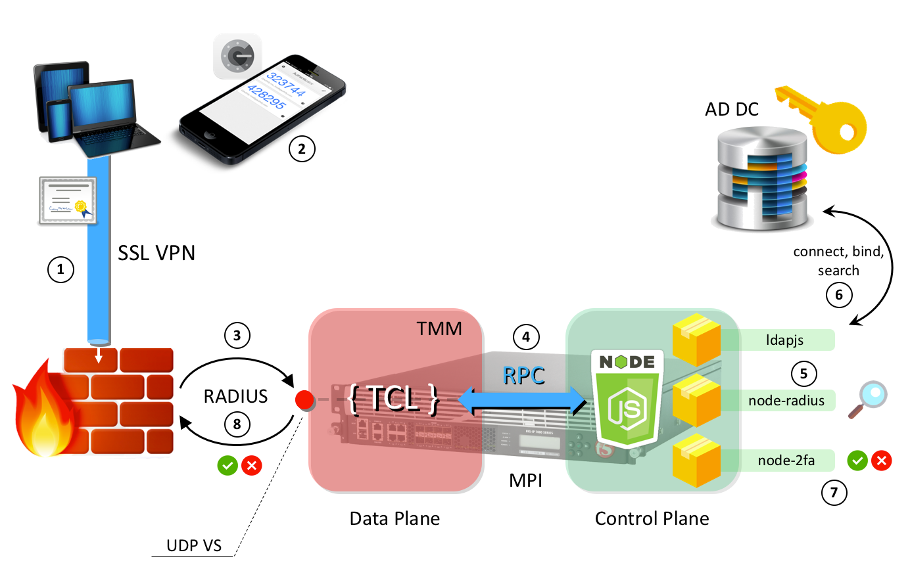

F5 iRules LX - Google Authenticator OTP over RADIUS
================

[TCL](/iruleslx) and JavaScript code used in the F5 iRules LX - Introduction video:

https://www.youtube.com/watch?v=7yRP2fPCxIs

 
## Flow Topology

 
## DevCentral Article
https://devcentral.f5.com/articles/radius-proxy-with-google-authenticator-20898
